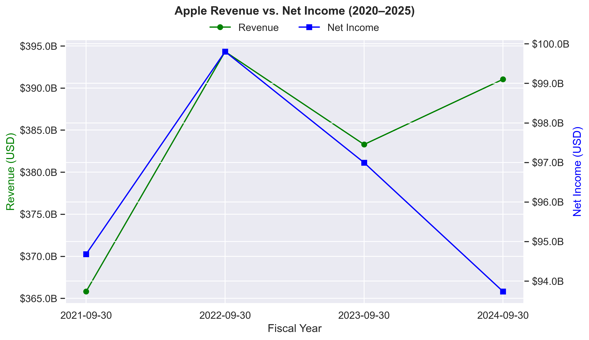
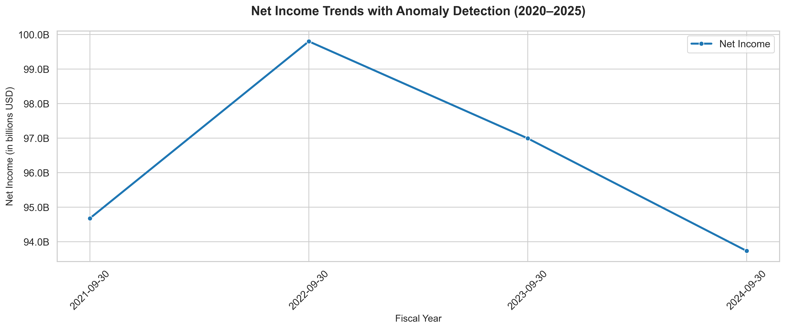
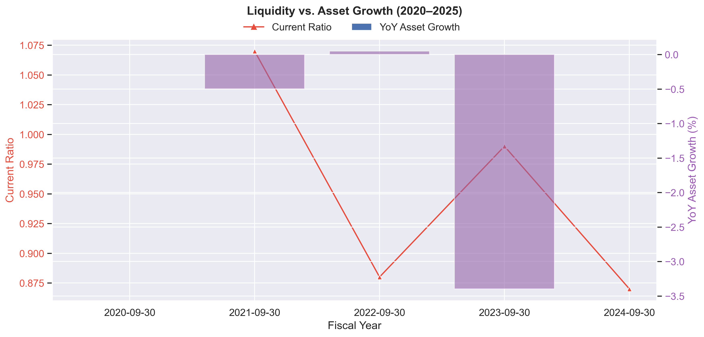

# Corporate Financial Analysis (2020–2025)  

A data engineering project analyzing financial statements for liquidity, profitability, and growth insights._

# Setup 
 
1. Clone the repo:  
   ```cmd```
	git clone https://github.com/Nihar-24/corporate-fin-analysis.git

2. Install dependencies:
	pip install -r scripts/requirements.txt

3. Database Setup:
	Run docs/schema.sql in SQL Server.


4. Directory Structure:
	corporate-fin-analysis/
	├── data_raw/          # Raw financial data (untracked)
	├── data_processed/    # Processed data (untracked)
	├── scripts/           # ETL and analysis scripts
	├── docs/              # Schema diagrams, SQL scripts
	├── tests/             # Test cases
	├── plots/             # Visualizations (PNG/PDF)
	├── .gitignore         # Git exclusion rules
	├── readme.md          # This file
	└── license.txt        # MIT License	

5. Key Insights:

1. Current Ratio Trend (Liquidity)

The current ratio has fluctuated over the recent years, indicating changes in Apple's short-term liquidity position.

It was highest at 1.07 in 2021, then declined to 0.88 in 2022, slightly recovered to 0.99 in 2023, and dropped again to 0.87 by 2024.

A current ratio below 1 (as in 2024) suggests current liabilities exceed current assets, which may indicate tighter liquidity.

2. Net Income Anomalies

No anomalies were detected in Apple's net income data, suggesting consistent and stable profitability reporting over the period analyzed.

3. Return on Equity (ROE) Trend

ROE showed variability but remained strong, reflecting efficient use of shareholders' equity to generate profits.

It increased from 1.50 in 2021 to a peak of 1.97 in 2022, then decreased to 1.56 in 2023, and slightly rose to 1.65 in 2024.

This indicates some fluctuations in profitability relative to equity but generally robust returns.

4. Year-over-Year Asset Growth

Apple's total assets showed mixed growth trends.

Asset growth was slightly positive at 0.05% in 2022, but declined by about 3.4% in 2023 and nearly 0.5% in 2021.

This suggests some contraction or reallocation of assets in recent years rather than consistent expansion.

5. Year-over-Year Revenue Growth

Revenue growth was positive at 7.79% in 2022, declined by 2.8% in 2023, and rebounded to 2.02% in 2024.

This pattern indicates some volatility in revenue growth, with a notable dip in 2023 but recovery signs in 2024.

6. Summary

Apple's financial data reveals a company with strong profitability (high ROE), stable net income without anomalies, but facing some liquidity tightening (current ratio below 1 in 2024) and 

fluctuating asset and revenue growth in recent years. The revenue growth dip in 2023 followed by recovery and the asset growth contraction suggest strategic adjustments or market challenges 

during that period.


# Visualizations

## Revenue vs. Net Income Trends


## Net Income Anomalies


## Liquidity & Asset Growth
